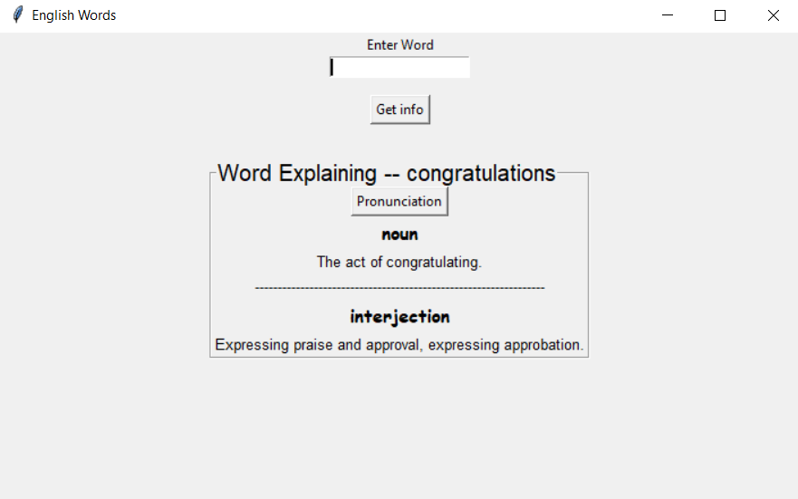

# English-Words App

>This desktop application was built using Python Tkinter.
>>
>It explains the word that it is entered in input area.
>>
>It builds a button when it is pressed that to pronounce the word if the response is exist from api

